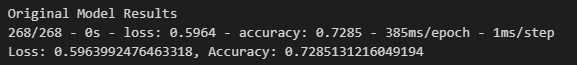
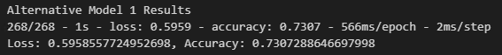
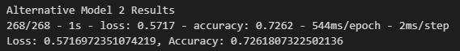
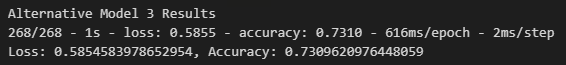

# Module 13 - Neural Networks

This is the page for the thirteenth module of the Fintech Bootcamp course, covering Deep Learning with Neural Networks.

This page is a continuation of my GitHub learning structure for this course.

Above you will see the *^*.ipynb file for this homework

Additional files include the source data and output h5 files.

## Results

* __*Neural Network Model 1*__
  * Epochs          : 50 
  * Layers          : 3  
  * Hidden Layer 1  : 10 
  * Hidden Layer 2  : 5  
  * Output Layer    : 1  

  

 

* __*Neural Network Model 2*__
  * Epochs          : 75 
  * Layers          : 4  
  * Hidden Layer 1  : 20 
  * Hidden Layer 2  : 10 
  * Hidden Layer 3  : 5 
  * Output Layer    : 1  

  

 
 

* __*Neural Network Model 3*__
  * Epochs          : 100 
  * Layers          : 5  
  * Hidden Layer 1  : 20 
  * Hidden Layer 2  : 10 
  * Hidden Layer 3  : 5 
  * Hidden Layer 4  : 2 
  * Output Layer    : 1  

  

 

* __*Neural Network Model 4*__
  * Epochs          : 100 
  * Layers          : 5  
  * Hidden Layer 1  : 10 
  * Hidden Layer 2  : 50 
  * Hidden Layer 3  : 50 
  * Hidden Layer 4  : 10 
  * Output Layer    : 1  

  

 

## Summary

I tried the first two models with just the 'relu' activation method and adding epochs or additional hidden layers didn't make much difference to the result.

I wasn't happy with that so, for this reason, I did a 4th model and played around with various activation methods including 'tanh', 'elu', 'relu, 'sigmoid', 'linear' and 'softmax' as well as various large and small neuron amounts without greatly improving on previous results. I got a slight improvement with the 4th but would need more time to improve the results further. It could be that is all that is achievable with the source data as well.

## Back to Fintech Home

* [Fintech Bootcamp Home](https://github.com/d4np3/fintech)
